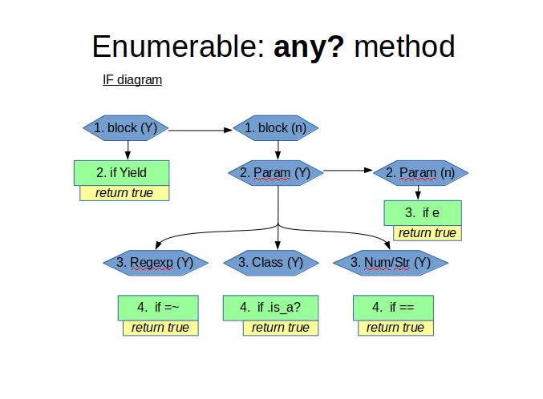
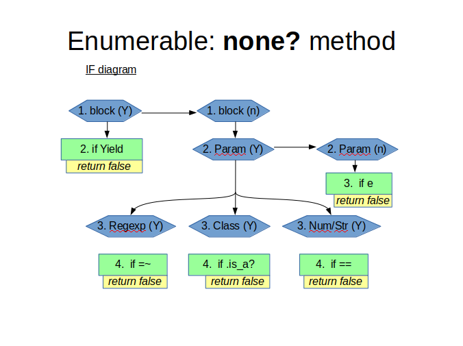
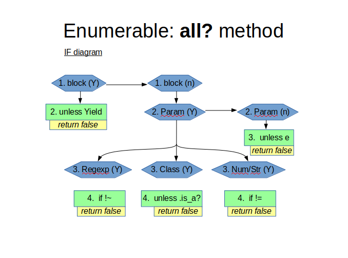
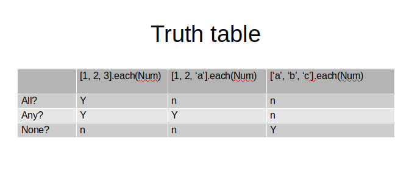

[![Contributors][contributors-shield]][contributors-url]
[![Forks][forks-shield]][forks-url]
[![Stargazers][stars-shield]][stars-url]
[![Issues][issues-shield]][issues-url]
[![LinkedIn][linkedin-shield]][linkedin-url]

# Microverse project, mv_Enumerable
*Overview-->*
This project has the object of Rebuilding new methods, making my very own copy of existing methods onto the existing Enumerable module.

The following where the methods created, each of them identical to the original ones without the 'my_':
- A `my_each`
- A `my_each_with_index`
- A `my_select`
- A `my_all?`
- A `my_any?`
- A `my_none?`
- A `my_count`
- A `my_map`
- A `my_inject`
- A test case for the `my_inject` by creating a method called `multiply_els` which multiplies all the elements of the array together by using 'my_inject'.
- [x] Modified the 'my_map' method to take a proc instead.

Here are examples of the coding logic for the _my_any?_, _my_none?_ and _my_all?_ methods:

Also a complete tasks guide has been made for this project so the steps can be seen thoroughly in this [Pivotal Tracker](https://www.pivotaltracker.com/n/projects/2423734) site.

## Technologies used:
1. **Ruby**

For more info, check the [Odin Project](https://www.theodinproject.com/courses/ruby-programming/lessons/advanced-building-blocks)

## Collaborators & profiles link:
- J. Alfredo Cardenas - [GitHub](https://github.com/newincome)

<!-- MARKDOWN LINKS & IMAGES -->
<!-- https://www.markdownguide.org/basic-syntax/#reference-style-links -->
[contributors-shield]: https://img.shields.io/github/contributors/NewIncome/mv_Enumerable.svg?style=flat-square
[contributors-url]: https://github.com/NewIncome/mv_Enumerable/graphs/contributors
[forks-shield]: https://img.shields.io/github/forks/NewIncome/mv_Enumerable.svg?style=flat-square
[forks-url]: https://github.com/NewIncome/mv_Enumerable/network/members
[stars-shield]: https://img.shields.io/github/stars/NewIncome/mv_Enumerable.svg?style=flat-square
[stars-url]: https://github.com/NewIncome/mv_Enumerable/stargazers
[issues-shield]: https://img.shields.io/github/issues/NewIncome/mv_Enumerable.svg?style=flat-square
[issues-url]: https://github.com/NewIncome/mv_Enumerable/issues
[linkedin-shield]: https://img.shields.io/badge/-LinkedIn-black.svg?style=flat-square&logo=linkedin&colorB=555
[linkedin-url]: https://www.linkedin.com/in/alfredo-cardenas-62b021183
